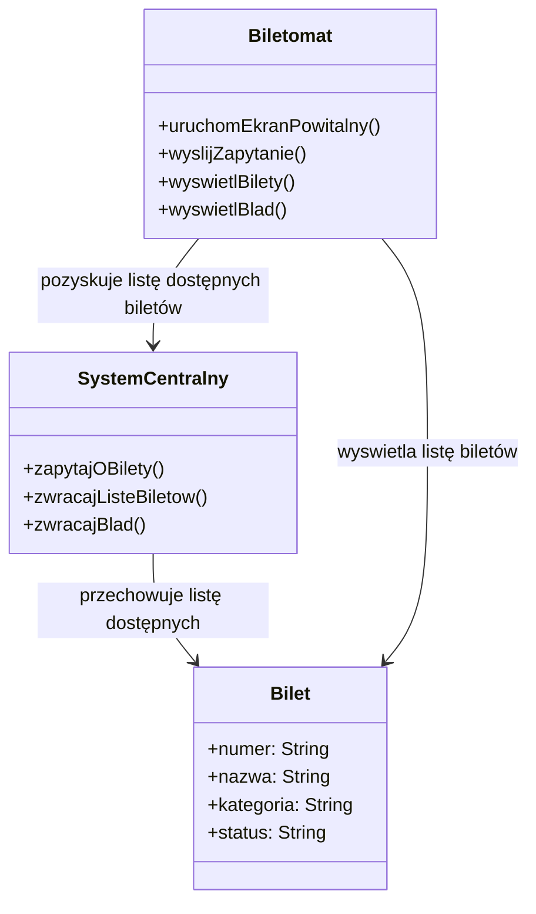
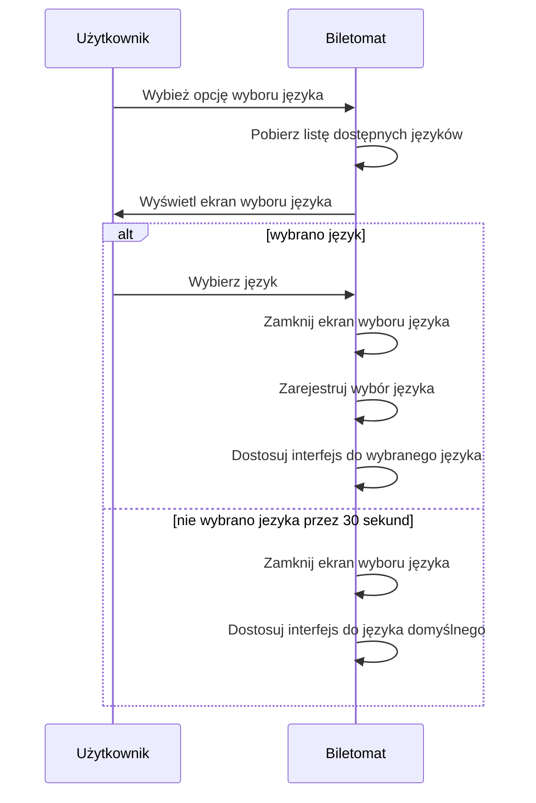
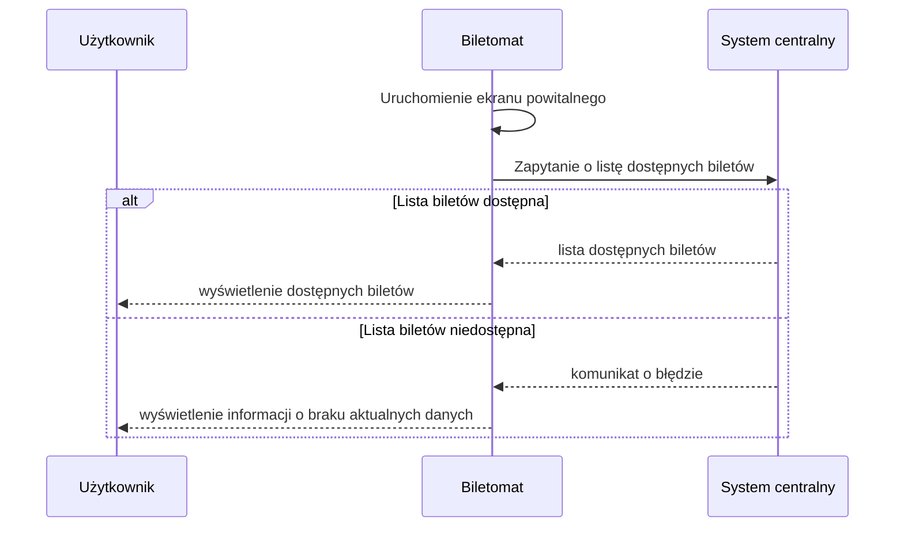
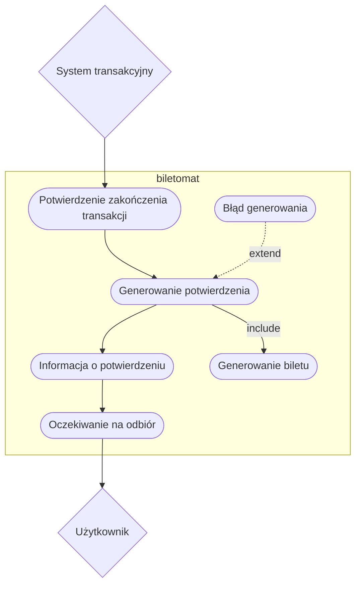
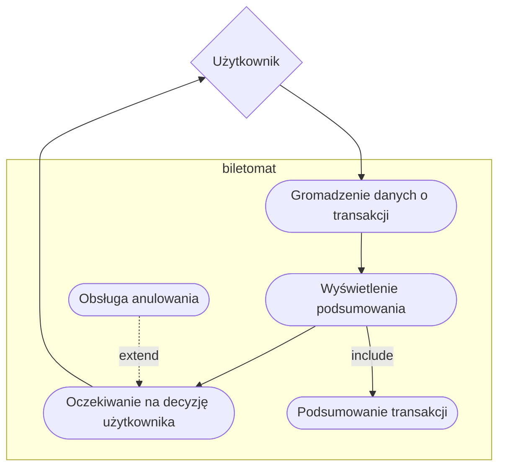

1. Jako biletomat, chcę automatycznie aktualizować listę dostępnych biletów i ich cen, aby zapewnić zgodność z polityką przewoźnika.
2. Jako biletomat, chcę rejestrować wszystkie transakcje i wysyłać raporty do systemu centralnego, aby umożliwić monitoring i kontrolę operacji.
3. Jako biletomat, chcę posiadać czytelny ekran dotykowy, aby użytkownik mógł łatwo nawigować po interfejsie.
4. Jako biletomat, chcę być wyposażony w różne metody płatności (terminal kart, czytnik gotówki, NFC), aby obsługiwać różnorodne transakcje.
5. Jako biletomat, chcę wydawać resztę w gotówce, jeśli użytkownik zapłaci nadmiarowo, aby transakcja była zgodna z oczekiwaniami.

# Diagramy klas

## Wyświetlenie dostępnych biletów

### KLASY

#### Biletomat
- **ATRYBUTY**: brak
- **METODY**:
  - `VOID uruchomEkranPowitalny()`: Uruchamia ekran powitalny w biletomacie, który jest wyświetlany użytkownikowi po włączeniu urządzenia.
  - `VOID wyslijZapytanie()`: Wysyła zapytanie do systemu centralnego, aby uzyskać listę dostępnych biletów.
  - `VOID wyswietlBilety()`: Wyświetla użytkownikowi listę dostępnych biletów wraz z ich szczegółami.
  - `VOID wyswietlBlad()`: Wyświetla użytkownikowi komunikat o błędzie, np. w przypadku braku dostępnych biletów lub problemu z połączeniem z systemem centralnym.

#### SystemCentralny
- **ATRYBUTY**: brak
- **METODY**:
  - `void zapytajOBilety(): Bilet[]`: Odpowiada na zapytanie biletomatu o dostępność biletów. Może zwrócić listę biletów lub wyjątek - komunikat o błędzie.

#### Bilet
- **ATRYBUTY**:
  - `String numer`: Numer biletu, który identyfikuje konkretny bilet.
  - `String nazwa`: Nazwa biletu (np. bilet normalny, ulgowy).
  - `String kategoria`: Kategoria biletu (np. bilety na podróż, bilety na wydarzenia).
  - `String status`: Status biletu (np. dostępny, wyprzedany).

### RELACJE:

- **Biletomat** KORZYSTA Z **SystemuCentralnego**: Biletomat wysyła zapytanie o dostępność biletów, a system centralny zwraca listę dostępnych biletów.
- **SystemCentralny** KORZYSTA Z **Bilet**: System centralny przechowuje dane dotyczące biletów (numer, nazwa, kategoria, status).
- **Biletomat** KORZYSTA Z **Bilet**: Biletomat wyświetla listę dostępnych biletów użytkownikowi, korzystając z danych przechowywanych w obiektach klasy `Bilet`.

# Diagramy sekwencji

## Obsługa wyboru języka
> - Aktor: Uzytkownik
> - Obiekty: Biletomat
> - Scenariusz główny:
>    - Uzytkownik wybiera opcję wyboru języka
>    - Biletomat pobiera listę dostępnych języków
>    - Biletomat wyświetla ekran wyboru języka
>    - Uzytkownik wybiera język
>    - Biletomat zamyka ekran wyboru języka
>    - Biletomat rejestruje wybór języka
>    - Biletomat dostosowuje interfejs do wybranego języka
> - Scenariusz alternatywny (brak wyboru uzytkownika przez 30 sekund):
>    - Biletomat uruchamia ekran powitalny (Uruchomienie ekranu powitalnego).
>    - Uzytkownik wybiera opcję wyboru języka
>    - Biletomat pobiera listę dostępnych języków
>    - Biletomat wyświetla ekran wyboru języka
>    - Biletomat zamyka ekran wyboru języka
>    - Biletomat dostosowuje interfejs do języka domyślnego

## wyświetlenie dostępnych biletów

> - Aktor: Biletomat Uzytkownik
> - Obiekty: system centralny 
> - Scenariusz główny:
>    - Biletomat uruchamia ekran powitalny
>    - Biletomat wysyła zapytanie o listę dostępnych biletów do systemu centralnego
>    - System centralny zwraca listę dostępnych biletów.
>    - Biletomat wyświetla kategorię biletów oraz szczegóły dotyczące ich dostępności
> - Scenariusz alternatywny (brak aktualnych danych):
>    - Biletomat uruchamia ekran powitalny (Uruchomienie ekranu powitalnego).
>    - Biletomat wysyła zapytanie o listę dostępnych biletów do systemu centralnego.
>    - System centralny zwraca komunikat o błędzie, np. awaria sieci.
>    - Biletomat wyświetla ostrzeżenie o braku aktualnych danych.

# Diagramy przypadków uzycia

## Generowanie potwierdzenia zakupu

### Obsługa wyboru języka

### Wyświetlenie dostępnych biletów

### Wyswietlenie podsumowania tranzakcji

### Diagram wspólny

