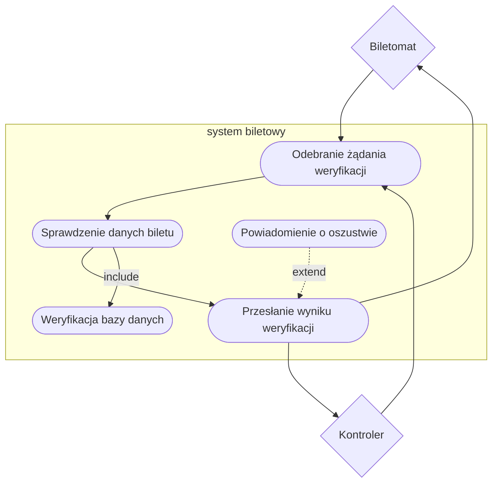

1. Jako system biletowy, chcę dostarczać aktualne dane o taryfach i typach biletów do biletomatu, aby użytkownik miał zawsze poprawne informacje.
2. Jako system biletowy, chcę umożliwiać sprawdzenie ważności biletu w czasie rzeczywistym, aby zapobiegać oszustwom.
3. Jako system biletowy, chcę rejestrować każde sprzedane bilety, aby śledzić ruch i sprzedaż w systemie.
4. Jako system biletowy, chcę współpracować z aplikacjami mobilnymi, aby użytkownik mógł uzyskać elektroniczny bilet w przypadku takiego wyboru.

### Diagramy przypadków uzycia

### Aktualizacja Taryf

### Weryfikacja ważności biletu

### Diagram wspólny

