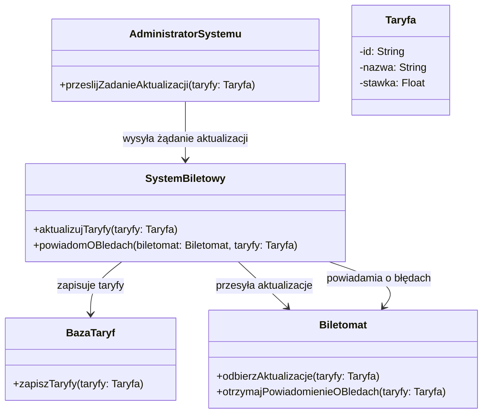
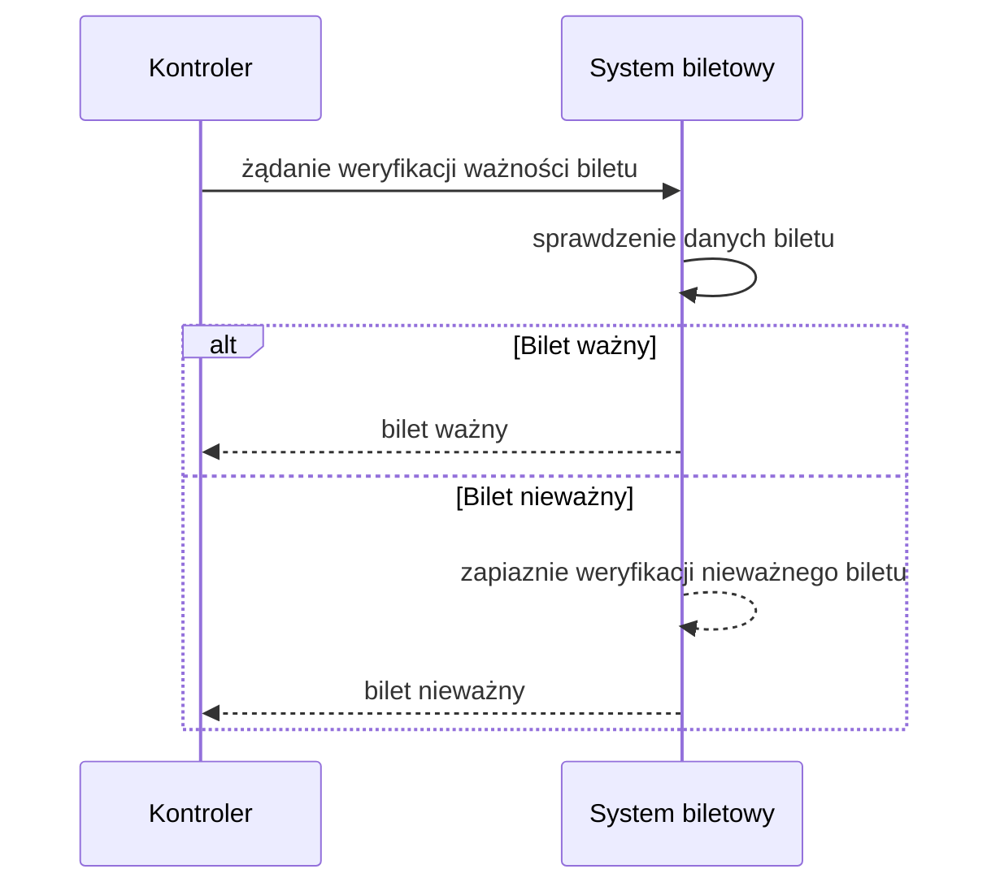
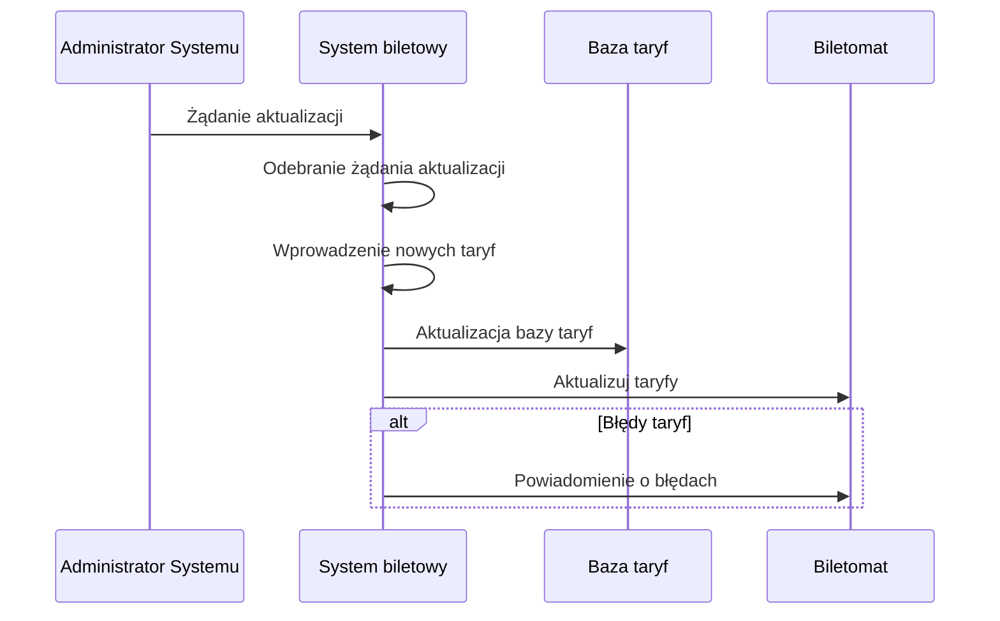
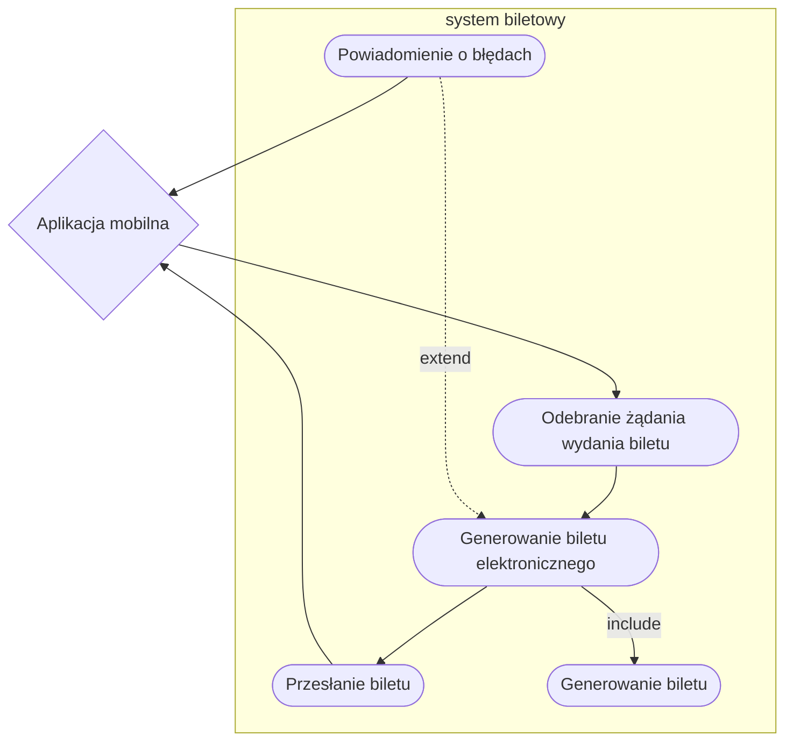
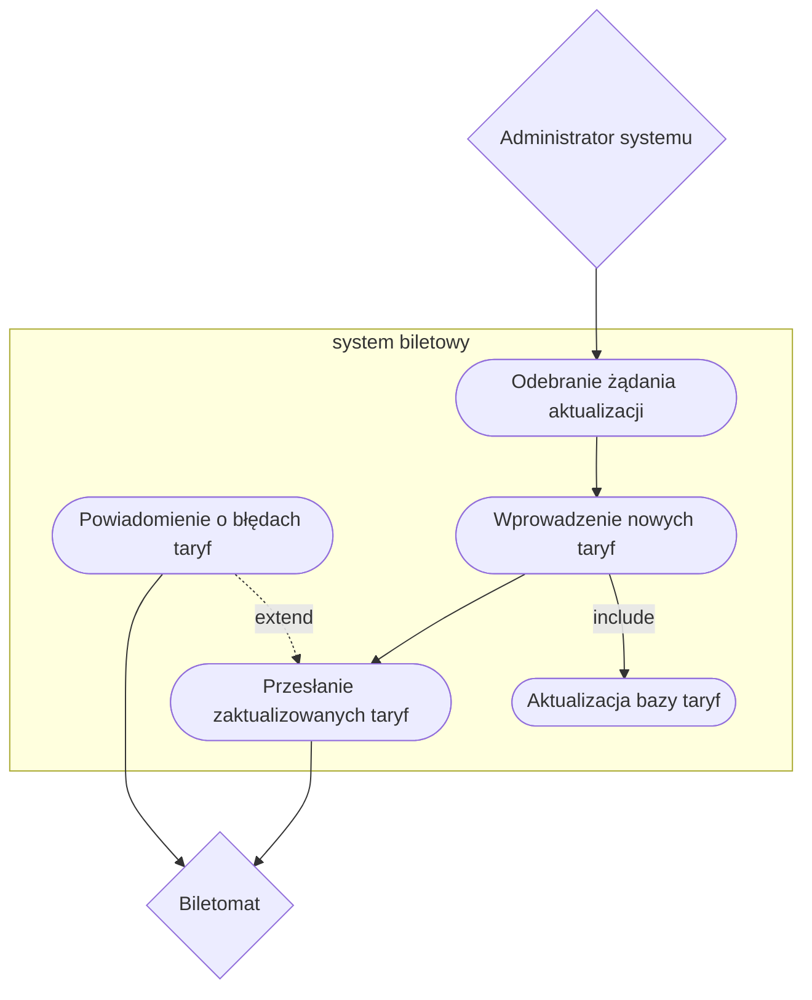
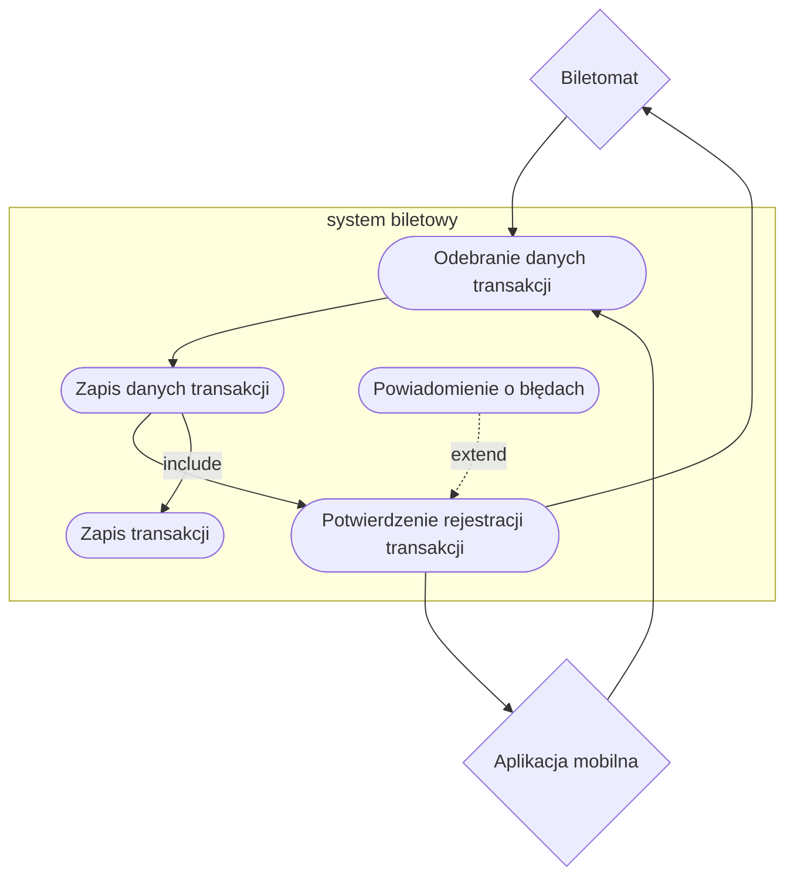
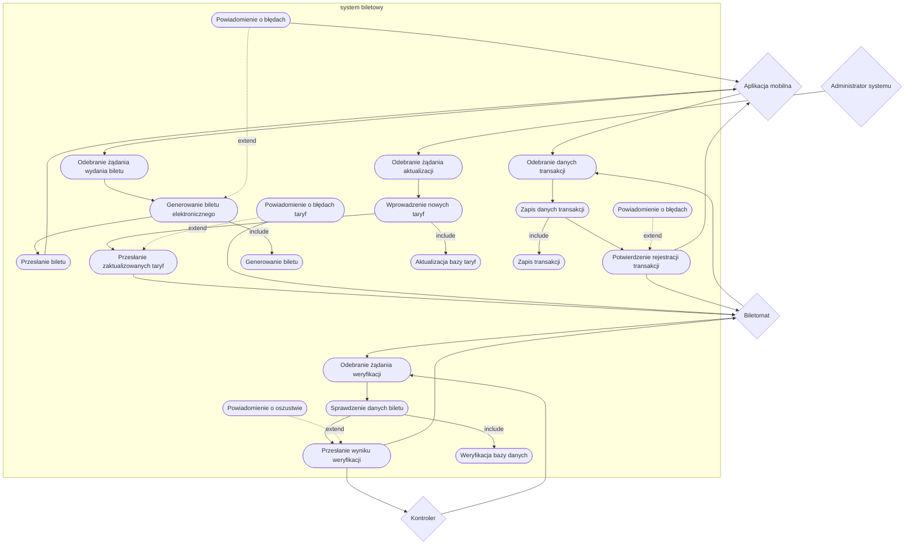

1. Jako system biletowy, chcę dostarczać aktualne dane o taryfach i typach biletów do biletomatu, aby użytkownik miał zawsze poprawne informacje.
2. Jako system biletowy, chcę umożliwiać sprawdzenie ważności biletu w czasie rzeczywistym, aby zapobiegać oszustwom.
3. Jako system biletowy, chcę rejestrować każde sprzedane bilety, aby śledzić ruch i sprzedaż w systemie.
4. Jako system biletowy, chcę współpracować z aplikacjami mobilnymi, aby użytkownik mógł uzyskać elektroniczny bilet w przypadku takiego wyboru.
# Diagramy klas
## Aktualizacja taryf 

## OPIS KLAS
### KLASY
#### SystemBiletowy
 - METODY: `aktualizujTaryfy(taryfy: Taryfa)`, `powiadomOBledach(biletomat: Biletomat, taryfy: Taryfa)`
#### AdministratorSystemu
 - METODY: `przeslijZadanieAktualizacji(taryfy: Taryfa)`
#### BazaTaryf
 - METODY: `BzapiszTaryfy(taryfy: Taryfa)`
#### Biletomat
 - METODY: `odbierzAktualizacje(taryfy: Taryfa)`, `otrzymajPowiadomienieOBledach(taryfy: Taryfa)`
#### Taryfa
- ATRYBUTY: `string id`,`string nazwa`,`Float stawka`
### Relacje
- `ADMINISTRATORSYSTEMU` JEST POWIĄZANY Z `SYSTEMBILETOWY` (ASOCJACJA): Administrator systemu wysyła żądanie aktualizacji taryf.
- `SYSTEMBILETOWY` KORZYSTA Z METODY `ZAPISZTARYFY` KLASY `BAZATARYF` DO ZAPISYWANIA TARYF.
- `SYSTEMBILETOWY` KORZYSTA Z METODY `ODBIERZAKTUALIZACJE` KLASY `BILETOMAT` DO PRZESYŁANIA AKTUALIZACJI.
- `SYSTEMBILETOWY` KORZYSTA Z METODY `OTRZYMAJPOWIADOMIENIEOBLEDACH` KLASY `BILETOMAT` DO PRZEKAZYWANIA INFORMACJI O BŁĘDACH.
- `SYSTEMBILETOWY` JEST POWIĄZANY Z `TARYFA` (ASOCJACJA): System wprowadza zmiany w taryfach.
- `BAZATARYF` JEST POWIĄZANY Z `TARYFA` (ASOCJACJA): Baza przechowuje dane taryf.
- `BILETOMAT` JEST POWIĄZANY Z `TARYFA` (ASOCJACJA): Biletomat otrzymuje aktualne taryfy.

 
# Diagramy Sekwencji

### Aktualizacja taryf

### weryfikacja ważności biletu
>- AKTOR: system biletowy
>- OBIEKTY: kontroler
>- Scenariusz główny:
>    - System biletowy odbiera żądanie weryfikacji ważności biletu od innego systemu 
>    - System biletowy sprawdza dane biletu w swojej bazie danych 
>    - System biletowy przesyła odpowiedź ważny do żądającego systemu 
>- Scenariusz alternatywny 1 (nieważny bilet):
>    - System biletowy odbiera żądanie weryfikacji ważności biletu od innego systemu
>    - System biletowy sprawdza dane biletu w swojej bazie danych i identyfikuje, że bilet jest nieważny 
>    - System biletowy wysyła odpowiedź o nieważnym bilecie do żądającego systemu 
>    - System biletowy rejestruje zdarzenie nieważnego biletu jako potencjalną próbę oszustwa 

### Aktualizacja taryf
>- AKTOR: Administrator systemu
>- OBIEKTY: System biletowy, Baza taryf, Biletomat
>- Scenariusz główny:
>    - Aktor przesyła żądanie aktualizacji taryf
>    - System biletowy odbiera żądanie aktualizacji taryf
>    - System biletowy wprowadza aktualizacje taryf
>    - System biletowy przesyła aktualizacje taryf do Biletomatu
>- Scenariusz alternatywny 1 (Błędy taryf):
>    - Aktor przesyła żądanie aktualizacji taryf
>    - System biletowy odbiera żądanie aktualizacji taryf
>    - System biletowy wprowadza aktualizacje taryf
>    - System biletowy przesyła aktualizacje taryf do Biletomatu
>    - System biletowy powiadamia Biletomat o błedach taryf

# Diagramy przypadków uzycia

### Współpraca z aplikacjami mobilnymi

### Aktualizacja Taryf

### Weryfikacja ważności biletu

### Rejestracja tranzakcji

### Diagram wspólny

